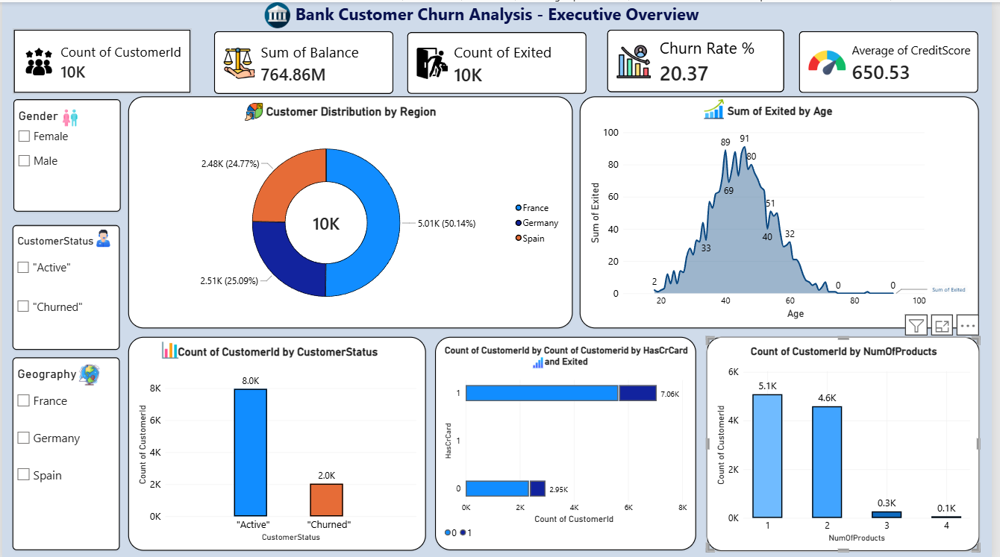
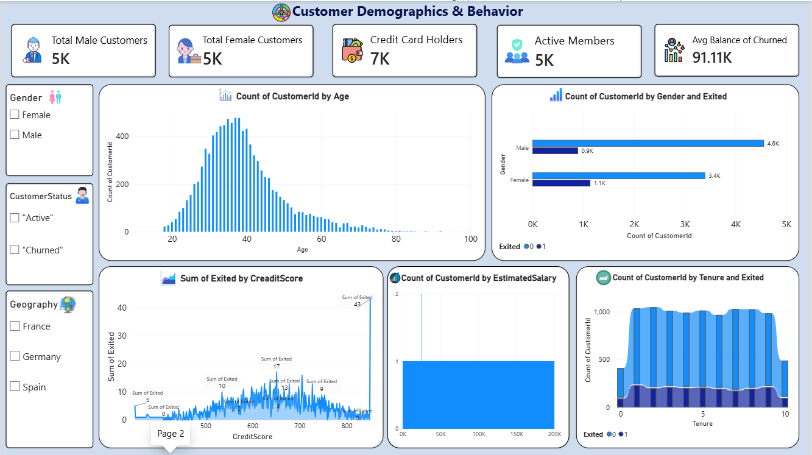
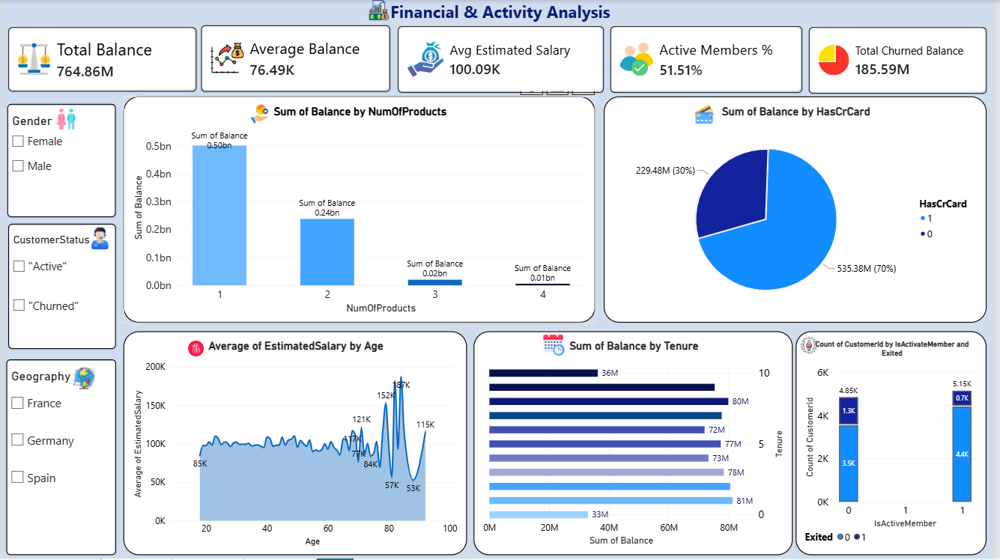

# Bank Customer Churn Power BI Analysis

Interactive Power BI dashboard for bank customer churn analysis, demographics, and financial metrics.

---

## 📊 Project Overview
The primary objective of this project is to analyze historical banking data to understand why customers leave the bank (Churn), identify high-risk customer segments, and support data-driven decision-making for customer retention[cite: 4].

---

## 📋 Key Dashboards & Pages Included
* **Executive Overview:** High-level summary of total customers (10K), total balance (764.86M), churn rate (20.37%), and regional distribution[cite: 1, 4].
* **Customer Demographics & Behavior:** Analysis of customer age groups, gender-wise churn patterns, credit scores, and tenure[cite: 2, 4].
* **Financial & Activity Analysis:** Evaluation of customer financial exposure, average balances, active member percentages, and total churned balance[cite: 3, 5].

---

## 🛠️ Tools Used
* Power BI Desktop
* DAX (Data Analysis Expressions) & Power Query
* Microsoft Excel / CSV Dataset[cite: 4]
* GitHub

---

## 📁 Files Included
* `Project.pbix` - Main Power BI Report File
* `Bank_Customer_Churn_DA_Report.pdf` - Detailed Data Analytics Project Report[cite: 4]
* `Churn_Modelling.csv` - Project Dataset[cite: 4]
* `Dashboard 1.png` - Executive Overview Screenshot[cite: 1]
* `Dashboard 2.png` - Customer Demographics & Behavior Screenshot[cite: 2]
* `Dashboard 3.png` - Financial & Activity Analysis Screenshot[cite: 3]

---

## 📸 Dashboard Preview

### Dashboard 1 (Executive Overview)

### Dashboard 2 (Customer Demographics & Behavior)

### Dashboard 3 (Financial & Activity Analysis)

---
